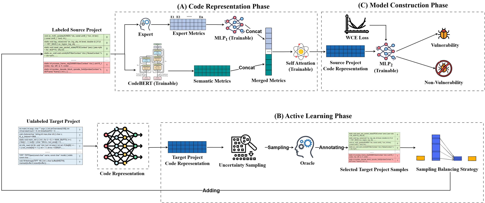

# CSVD-AES: Cross-project software vulnerability detection based on active learning with metric fusion

This is the source code to the paper "CSVD-AES: Cross-project software vulnerability detection based on active learning with metric fusion". 

# Approach



## About the Datasets

You can download the original data from [here](https://github.com/DanielLin1986/TransferRepresentationLearning). The data needs to be processed into a format similar to the files under the `CSVD-AES/cp_data` folder. Specifically, the data should be organized as **txt files**, with each line formatted as: label<SPLIT>source code<SPLIT>standardized manual metrics

**Notes:**

- `<SPLIT>` is the separator between the label, source code, and metrics.  
- The `standardized manual metrics` should be a list of numerical features extracted from the source code.  
- Make sure each line follows the format exactly, otherwise the model may not load the data correctly.

## Environment Setup

    pip install torch
    pip install transformers
    pip install numpy
    pip install gdown
    pip install tqdm
    pip install pickle
    pip install sklearn
    pip install pandas
    pip install tokenizers


## Figure

We put the figures in `figs\` folder

## Run

If you want to directly run our model, navigate to the ALStage folder and run the training script:

```bash
cd CSVD-AES/ALStage
python do_train.py
```

## References

[1] Z. Cai, Y. Cai, X. Chen, G. Lu, W. Pei, J. Zhao, Csvd-tf: Cross-project software vulnerability detection with tradaboost by fusing expert metrics and semantic metrics, Journal of Systems and Software 213 (2024) 112038.

[2] Saikat Chakraborty, Rahul Krishna, Yangruibo Ding, and Baishakhi Ray. 2020. Deep Learning based Vulnerability Detection: Are We There Yet? arXiv preprint arXiv:2009.07235 (2020).

[3] M. Fu, C. Tantithamthavorn, Linevul: A transformer-based line-level
vulnerability prediction, in: 2022 IEEE/ACM 19th International Con-
ference on Mining Software Repositories (MSR), 2022, pp. 608–620.

